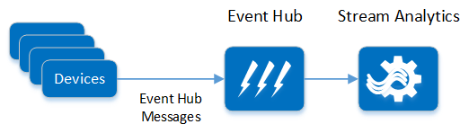

# Event Ingestion

Getting events into the system is the most basic task for an IoT solution, and yet also the most critical. 

- [Common requirements](#common-requirements)
- [Fabrikam requirements](#fabrikam-requirements)
- [Exploring solutions](#exploring-solutions)
- [Reference implementation](#reference-implementation)
- [Lessons learned](#lessons-learned)

## Common requirements

Here are some common requirements for event ingestion in an IoT solution:

- Authentication. Only authenticated devices can send data. (Provisioning devices is a separate scenario, although closely related.)
- Achieving scale. That means both hitting the expected target data rate, but also designing the system to be scalable in the future.
- Protecting the data stream.
  
## Fabrikam requirements

:memo: For more about our Fabrikam scenario, see [About the Reference Implementation][reference-impl]. 

Here are some specific requirements for our scenario:

- As an initial target, the system must handle up to 100,000 devices, each device sending 1 reading every minute. That's approximately 1,667 events per second. This is a minimum load &mdash; the system should be scalable beyond this target. 
- The event data stream must be protected. This means not only securing the content of the events, but also masking the *absence* of events. For example, if the motion detectors in a house are not streaming any events, an attacker can conclude that nobody is home.
- Several processing components will sit downstream from event ingestion. (See [Long-term storage] and [Ad hoc exploration].) The system must be designed so these components will not introduce delays in the rest of the system.
-  Related to the previous point, a failure in one of the downstream processing components should not cause event ingestion to fail.

## Exploring solutions 

Event **ingestion** and event **processing** are somewhat related. How the system ingests the events may limit the options for processing. We investigated the following options.   

- HTTP service
- Azure Service Bus topics + message subscriber
- Azure Event Hubs + custom event processor 
- Event Hubs + Azure Stream Analytics
- Event Hubs + Apache Storm 

> We chose Event Hubs and recommend this approach. The HTTP service approach has some significant drawbacks, described below. Service Bus topics are conceptually similar to Event Hubs, but Event Hubs is capable of much higher throughput, so it's a better fit for IoT scenarios.

### HTTP service

In this approach, devices (or the field gateway) send HTTP requests. The cloud service runs a simple HTTP service that receives the requests and processes them. The HTTP service could be implemented as a web role in an Azure cloud service.

Notice that in this design, the HTTP service handles both ingestion and processing.

This approach has some significant drawbacks: 

1. **Throughput.** IIS puts requests in a queue until a worker thread picks them up. If requests back up in the queue, it can lead to timeouts. You can scale by adding more instances, and the Azure load-balancer will ensure an even distribution. However, there is a limit of 25 role instances per deployment. That should be enough for the Fabrikam scenario, but may not be enough for other scenarios.

	> We briefly considered whether we could use virtual machines running an open source web server, optimized specifically for this task. However, that means taking responsibility for maintaining and patching the VMs and the web server software. There are also security concerns with this approach &mdash; it's not easy to harden a custom web server.

2. **Load leveling.** A related problem is that the HTTP service handles both ingestion and processing. If the downstream processing can't keep up, it might cause ingestion to fail. This can happen during sudden bursts of traffic, or if the event processing component has a transient failure (perhaps due to another service it relies on).   
 
3. **Resilience and reliability.** If an instance of the service fails, then any messages it is processing might be lost. 

4. **Authentication.** This approach requires building in some type of authentication, presumably using access tokens.  

5. **Connectivity**. Many simple devices can't send HTTP messages, and devices that *can* send HTTP messages are unlikely to use the same schema. Therefore, a field gateway may be needed to translate device messages.

	> Many devices are designed to be simple; they output signals indicating events, and can receive signals for commands to be performed. They might not be capable of translating this data into different formats for integration into an IoT solution; this process typically requires some auxiliary hardware and/or software.

To ameliorate items 1 &ndash; 3, you can put the incoming messages onto a queue, and create a separate process that consumes them. (For background, see [Queue-Centric Work Pattern][queue-centric-work-pattern] and [Queue-Based Load Leveling Pattern][queue-based-load-leveling].) In fact, a big advantage of both Service Bus and Event Hubs is that they use a publisher/consumer model, which separates ingestion from processing.  

### Service Bus topics

In this approach, devices (or a field gateway) send event data to a Service Bus topic. Worker role instances subscribe to this topic to process the events. 

**Pros:**

- **Load levling.** You can scale up the number of worker roles, independently of scaling the Service Bus instances. 

- **Authentication.** Service Bus supports authentication using Shared Access Signature (SAS) tokens. On the processing side, the worker role gets messages from a well-known endpoint and does not accept unsolicited incoming traffic.

- **Performance** Service Bus supports the [AMQP] message protocol. This protocol is very efficient, using binary encoding, network flow control, long-lived connections, etc. 

**Concerns:**

- **Scalability.** There is a limit of 25 worker role instances per cloud service deployment.

- **Connectivity.** Devices need to be able to communicate with Service Bus in order to post messages. As before, local field gateways may be necessary to provide this connectivity.

- **Throughput.** Because Service Bus topics implements queuing semantics, using reader locks, it can't achieve the same throughput as Event Hubs.   

### Event Hubs + worker role

[Azure Event Hubs][event-hubs] is a cloud-scale telemetry ingestion service. It is designed to capture millions of events per second in near real-time.

In this approach, devices (or a field gateway) send events to an event hub. Worker role instances process the events.

**Pros:**

- **Load levling.** As with Service Bus topics, can scale up the number of worker roles, independently of scaling the Service Bus instances. 

- **Throughput.** Event Hubs can achieve much higher throughput than Service Bus topics (up to 1 million events per second). 

- **Scalability.** Event Hubs is highly scalable through partitioning. An event hub can contain up to 32 partitions; each partition can receive messages in parallel with other partitions. Event Hubs is designed to handle a continuous, large influx of events. It can process up to 1MB/second of data per partition &mdash; well beyond requirements of our Fabrikam scenario.

- **Authentication**. Event Hubs supports authentication using Shared Access Signature (SAS) tokens. You can set security policies to help protect an event hub and authenticate message senders. Event Hubs also supports blacklisting of devices.

**Concerns:**

- **Complexity.** The Event Hubs programming model is significantly different from Service Bus queues and topics. For example, in Event Hubs, the receiver does not remove message after processing. The [Event Hubs Programming Guide][event-hubs-programming-guide] contains the details. (This [blog post][event-hubs-vs-azure-messaging] has a good summary of the differences.) However, the Azure .NET SDK provides a [high-level API][event-processor-host] for consuming events, that simplifies keeping track of which events in which partition have been read.

- **Throttling.** Event Hubs is priced in terms of throughput units. A throughput unit specifies the rate at which data can be sent and received by using Event Hubs. If an application exceeds the number of purchased throughput units, performance will be throttled and may trigger exceptions. The DevOps team must constantly monitor the event hub to ensure that sufficient throughput units are available.

- **Scalability.** There is a limit of 25 worker role instances per cloud service deployment.

> [Apache Kafka][apache-kafka] is another technology that is functionally similar to Event Hubs. However, Event Hubs is offered as a managed service in Microsoft Azure. To use Kafka, you would need to provision the necessary VMs and manage your own cluster. The primary motivation for running Kafka would be if you had an existing dependency in a system that you were migrating to Azure.

### Event Hub + Azure Stream Analytics

[Azure Stream Analytics][stream-analytics] is a real-time stream processing service. It can capture incoming streams of data from many sources, combine them, and arrange for these streams to be processed and send the results to one or more destinations.

In this approach, devices (or a field gateway) send events to an event hub. Stream Analytics takes the events as input and writes them directly to storage. (Stream Analytics can write to Azure Blob storage, Azure Table storage, or Azure SQL database.)  

**Pros:**

- **Ease of Use:** Stream Analytics uses a declarative model to specify the input and output streams, and the transformations to be performed by the processing. It can gather data directly from Event Hubs as well as sources such as Blob storage, and can emit data to Event Hubs, Blob storage, Table storage, and Azure SQL Database.

- **Scalability:** As with Event Hubs, Stream Analytics is designed to be highly scalable, capable of supporting event handling throughput of up to 50Mb/second. Stream Analytics will automatically scale based on the event ingestion rate, complexity of processing, and expected latencies.

- **Reliability:**  The Stream Analytics service is built to persist state and cache output efficiently. These features provide fast recovery from processing node failures, quickly reprocessing lost state.

**Concerns:**

- **Event Metadata.** The event stream passed to Stream Analytics does not include the event metadata that is captured by Event Hubs. This metadata can be valuable and can include information not available in the main payload of the event data. If this metadata is required, it might be necessary to connect directly to Event Hubs and use an alternative approach to Stream Analytics.

### Event Hubs + Apache Storm

:construction: TBD 

## Reference implementation

For the reference implementation, we picked **Event Hubs** and **Stream Analytics** for event ingestion and processing. Although these technologies are very new, the scalability, reliability, securability (the ability to verify and protect event information as it is received), and ease of use swung the decision; the maintenance and monitoring costs of this solution are far less than those concerned with using web and worker roles.

:construction: **TODO: Would be good to show table of costs, comparing web/work roles to EH, Stream Analytics** 

Our device simulator sends events directly to Event Hubs. A Stream Analytics job fetches the data for every event and sends it to blob storage. Each event is saved as a line-delimited JSON object for maximum interoperability.

In addition, we decided to implement a secondary batch processor for handling events directly from Event Hubs. This batch processor has access to the event metadata that is not available to Stream Analytics and can perform additional processing based on this information. 

## Lessons learned

We ended up spending a significant amount of time on the device simulator. It is important to simulate a realistic number of devices, sending events at the expected rate. In our original planning, we didn't give much thought to the simulator, but in talking to customers, this turns out to be a very common requirement. 

We hit the following issues when using Stream Analytics to save data to Blob storage:

- HDInsight Hive queries will fail when running against data held in blob files being actively written to by Stream Analytics. It is possible to workaround this problem by ignoring blob access exceptions.
- HDInsights requires the data held in Blob storage to be JSON formatted with each record on a new line. This requires configuring the Stream Analytics output format appropriately.

*TODO Others?*

[reference-impl]: 03-reference-implementation.md
[Long-term storage]: 05-long-term-storage.md
[Ad hoc exploration]: 06-ad-hoc-exploration.md
[traffic-manager]: https://azure.microsoft.com/documentation/articles/traffic-manager-overview/
[AMQP]: https://www.amqp.org/
[event-hubs-programming-guide]: https://msdn.microsoft.com/library/azure/dn789972.aspx
[blob-storage]: http://azure.microsoft.com/documentation/articles/storage-dotnet-how-to-use-blobs/
[event-hubs]: http://azure.microsoft.com/services/event-hubs/
[stream-analytics]: http://azure.microsoft.com/services/stream-analytics/
[queue-based-load-leveling]: https://msdn.microsoft.com/en-us/library/dn589783.aspx
[queue-centric-work-pattern]: http://www.asp.net/aspnet/overview/developing-apps-with-windows-azure/building-real-world-cloud-apps-with-windows-azure/queue-centric-work-pattern
[event-hubs-vs-azure-messaging]: http://microsoftintegration.guru/2015/03/03/azure-event-hubs-vs-azure-messaging
[apache-kafka]: https://kafka.apache.org/
[event-processor-host]: https://azure.microsoft.com/en-us/documentation/articles/event-hubs-programming-guide/#event-processor-host
