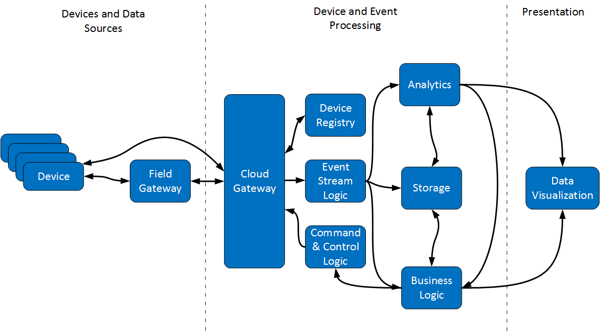

# What is an IoT solution?

The fundamental reason for implementing a network is to connect computing resources together. Initially local area networks were commonly used for many business scenarios such as sharing access to devices such as hard disks and printers, and then for communications applications such as email and messaging. The Internet enabled publicly accessible wide-area networking, allowing remote machinery and users to communicate. Nowadays, it is possible to connect almost any network-enabled device to the Internet to send and receive information from other similarly connected devices. This connectivity enables a wide range of scenarios, from remote monitoring and control of the heating and air conditioning of an apartments from a users smart phone, to highly complex situations such as driverless cars or remote controlled aircraft. This is the *Internet of Things* or IoT.

The concept of IoT is not new - the Internet has been around in various guises since the 1960s, and businesses have been connecting computers to hardware over a network for just as long. What is new is the affordability of hardware, the increased bandwidth and ubiquity of the Internet, the notion of virtualization, and the application of cloud services to combine devices together to support increasingly complex and large-scale scenarios. It is not uncommon for businesses to consider building systems that gather input from, and control, many thousands or even millions of heterogeneous items of equipment.

A development team faced with implementing a IoT solution has to wrestle with several significant challenges, including:

- What data is required to support the functionality of the solution, and what devices can provide this data?

- How can the system support a variety of different types of devices?

- How can the system control devices quickly and reliably?

- How will the system can scale and remain responsive as the volume of devices increases?

- Where will device data be stored, and for how long? How will this data be processed?

- How can a large number of devices be deployed and maintained in a cost-effective manner?

- How can network communications and data be protected from intrusion, interruption, or malicious external activities?

The following sections provide some high-level guidelines to help you address these challenges.

> Note: For a definition of common IoT terminology, see the [Glossary of Terms](glossary.md)

# Start small, think big

It is very easy to become overwhelmed by the sheer volume of data and the number of devices that an IoT system might be expected to handle. In addition, it can be hard to predict in advance which sensors and devices might provide the data that your system requires. 

Rather than attempting to build a system that solves every problem at once, start end-to-end prototyping with a small number of devices, but focus on designing an architecture that will scale, is low-latency, and that can handle extreme hardware and software heterogeneity. Consider that some critical data might require immediate action while a large volume of information may need to be stored for subsequent analysis and decision-making. Furthermore, identifying how data flows from devices all the way through the system to the analytics processing and business domain logic can help to highlight issues that might otherwise be missed.

Implementing an initial subset of the system will help to highlight where possible issues are likely to occur. These issues include resolving device identity, management, update, and deployment of devices, and security concerns. It is easier to address these issues in the small scale. Be prepared to evaluate whether the prototype meets expectations, make any necessary adjustments, and then document the lessons learned so that you can apply them to the large scale.

# Focus on telemetry first

Devices and sensors are intended to report information about their state, while many devices can also accept commands to change their state controlled by the business logic of the system. It can be inefficient to try and incorporate complex state-changing business processes in an IoT system until the data reported by devices and device capabilities are fully understood. Instead, start by focussing on the telemetry provided by devices (not only the state information that a device reports, but also diagnostics that help to establish device health). Privacy and security issues tend to be simpler for telemetry than for command and control, so this approach enables you to focus on security and manageability of the system before becoming embroiled in detailed transformational logic.

Prototyping with telemetry can also give you an idea of how your system will respond under load. The system must be capable of ingesting data quickly, performing hot path processing of this data within the expected time-frame, and store potentially large volumes of data for cold path analysis without becoming overwhelmed.

# Don't interrupt the hot path

Critical state information retrieved from devices may need to be handled quickly. Don't create processing bottlenecks in the hot path. For example, don't transform and manipulate the raw data unnecessarily unless the system can handle such transformations at scale. Additionally, store data for future analysis in its raw form and use the cold path processing to perform any required data conversions.

# Handle defense in depth

Consider security, identity, and management from the very start; this is not something that can be added in later. Think about security on the device itself, as data is transferred over the network, and as it is received, stored, and processed. In particular, consider the following aspects:

- Physical security and tamper detection of all devices in the field.

- Firmware security and secure boot to prevent hardware being compromised.

- Network protocol security to protect data in flight.

- Application security to prevent loss and leakage of sensitive information.

- Identity management for devices (prevent unexpected, rogue devices from being introduced into the system) and users.

- Data privacy protection and controls to ensure that data is stored securely.

# Design for a long life

An IoT solution is a significant investment. Once a device has been deployed to the field it might be there for a long time; don't necessarily expect that you will be able to replace it with newer hardware or update the firmware easily. Consequently, an IoT system should be designed to last, possibly for decades. 

You should also consider that the nature of technology is such that newer, more powerful devices can become available at relatively short notice. Innovations that increase the functionality or speed of devices can enable more advanced scenarios as the system evolves and expands. An IoT system should therefore be designed to support not only the current state of the art devices, but also allow for the integration of sensors, hardware, and capabilities (including new software and infrastructure) that may become available in the future.

# Design for composability

Design the system with clear, well-defined interfaces to enable composability. This will allow the system to be easily extended by integrating new devices, architectural components, processing capabilities, and services. Analysis models and decision-making logic can be more easily modified and evolve to adapt to changing business requirements.

# Build to the reference architecture

IoT is not specific to any particular sector or industry. Analysis has shown that the same principles can be applied regardless of whether an IoT solution is concerned with industrial automation and manufacturing, vehicle fleet management, healthcare, smart buildings, or a plethora of other cases in which remote devices provide information and can be controlled by some form of feedback loop. 

The following logical architecture is intended to be a generic description of an IoT solution which can be applied and adapted to any specific case.

In this diagram:

- Devices are *things* (as in *Internet of Things*) that generate events. Devices may be simple or composite and include a variety of sensors. A device can communicate with the system running in the cloud, through one or more gateway services. Devices might also be able to communicate directly with each other.

- The Field Gateway can implement local logic close to a collection of devices. It is optional. The field gateway might act as an aggregator, accumulating responses from devices and combining them into events. It can also provide a distribution point for commands and other data sent from the system in the cloud, directing operations to the appropriate devices.

- The Cloud Gateway is the primary endpoint for ingesting events from devices in the field. It might also have other functions, such as handling authentication and authorization at the application level, translation, connection management, and command delivery.

- The Device Registry is used by the system to identify devices, and is maintained when devices are provisioned and deprovisioned. Some features of the cloud gateway (such as authentication) might need information that is held here.

- Event Stream Logic handles the stream of event information that arrives from devices in the field. It may compromise multiple consumers and is a point of composition in the system.

- Storage is the repository used by the system for holding event information and device status. This repository might compromise several data stores optimized for particular patterns of access and partitioned for scalability and performance.

- Analytics includes the hot path and the cold path. The hot path must be optimized to ensure that events are captured, processed, and reported within the required timeframe.

- Business Logic is the domain-specific logic of the system.

- Command & Control Logic handles outbound messages being sent to devices. This area is a considerable security concern - the outbound path must not be compromised as it could have serious consequences (consider what might happen if a device receives a rogue command).

- Data Visualization covers the presentation logic of the system, including business reporting and charting, as well as dashboards that can be used to assess the overall health and stability of the system.

# Further information

- [Internet of Things Overview](http://channel9.msdn.com/Events/Build/2015/2-652)

- [Best practices for creating IoT solutions with Azure](http://blogs.microsoft.com/iot/2015/04/30/best-practices-for-creating-iot-solutions-with-azure/)

- [IoT Security Fundamentals](http://channel9.msdn.com/Events/Ignite/2015/BRK4553)

- [Glossary of Terms](glossary.md)