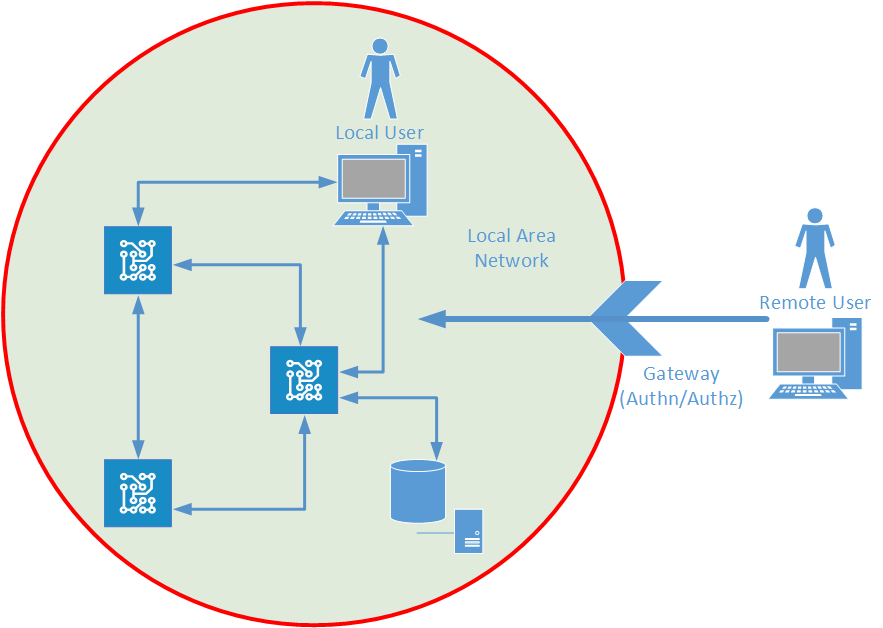
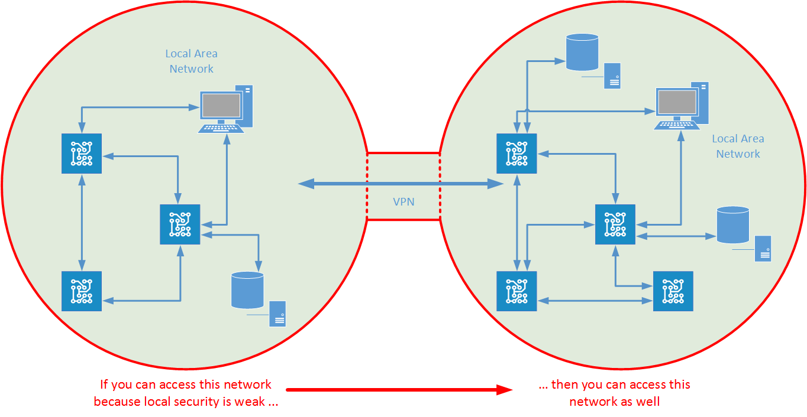

# Introduction to IoT security

IoT systems can contain many moving parts, each of which need to communicate and coordinate with each other in a secure manner. In a highly connected environment, security is not simply a matter of protecting individual resources, but is also concerned with protecting the information that is transferred between those resources.

# Security in connected *things*

A typical IoT solution can encompass a range of systems and devices, each of which might provide their own isolated level of security. The degree of protection that each *thing* provides is often a function of the complexity (and cost) of that thing. In essence, each thing implements what the manufacturer considers to be an appropriate level of protection for the environment in which it is expected to be utilized. In the case of a simple device such as a thermometer, security might be minimal; the data can only be read and there is ostensibly little damage that can occur if this data is not protected. However, place that thermometer inside a bigger IoT system that is measuring the temperature of an industrial furnace, then the value of the data dramatically increases; it must be made available to whatever system is controlling the furnace very quickly and it must not be compromised otherwise the furnace could malfunction with disasterous consequences. The same issues applies to more complex devices (those that can be programmed to perform operations as well as simply provide data), and even to subsystems within an IoT solution.

A facet of IoT solutions is that they can combine many existing systems together in ways that were unimaginable when those systems were first implemented. An existing system may have been intended to operate within a closed environment or local area network. For example, a set of traffic lights for a single road junction might incorporate sensors that can improve traffic flow by detecting approaching traffic rather than simply being based on a timer mechanism. This is a closed system in which the only participants are the traffic lights and the sensors, and security is likely to be minimal. If the system fails or is attacked in some way, it may cause a little inconvenience, but nothing that couldn't be temporarily solved by posting a policeman to direct traffic.

If this system is subsequently incorporated, with other sets of traffic lights and sensors, into a city-wide coordinated traffic management solution then the situation changes. The integration of many local systems into a large scale solution by connecting them together not only expands the possibility of failure but also increases the potential attack surface. A terrorist that is able to penetrate the network now not only controls a single set of lights, but possibly the entire road system of the city. The minimal security connecting each set of lights with its associated sensors could be a significant vulnerability. It is always important to remember the adage that a system is only as secure as its weakest point.

> Security in an IoT system is greater than the sum of the security of the individual elements.

# Safety and privacy

In an IoT solution, security and safety are commonly intertwined. Many IoT solutions control critical operations and the core of industrial and civil infrastructure. Consequently, digital security will be increasingly interwoven with the physical safety of life and equipment. This should provide deep motivation for ensuring that security is addressed in a robust and thorough manner.

Privacy is also a major concern. Many IoT systems provide very deep and near-real time insight into industrial and business processes, as well as into homes and the immediate personal environment. Data emanating from business processes is commercially valuable and is often a target for large-scale industrial espionage. Leakage of personal data can be embarrassing (and costly), but might also be life-threatening; if the whereabouts of a vulnerable or important person is easily tracked then that person becomes a sitting target.

# Defense in depth

A vitally important security strategy for any distributed is defense in depth. This is a matter of protecting the system at all levels and not relying on security at a single level, as follows:

- All devices, machinery, and any other hardware must be protected at the physical level. This means ensuring that hardware is inaccessible to unauthorized personnel, and that it is protected against tampering. This might include implementing physical intrusion detection.

- Devices and machinery must only be able to load and run trusted code. This might involve utilizing trustworthy platform hardware, signed firmware, and secure boot/load operations to prevent a machine from loading and running rogue components.

- All data entering and exiting the device must be protected by using secure networks involving appropriate levels of transport and application protocol protection. This typically involves encrypting all data as it is transmitted, and using trusted certificates to verify the source and destination of data.

- All transmissions must be authenticated to ensure that information is only provided by, and disclosed to, known identities.

- All data access must be explicitly authorized to ensure data privacy.

# Security limitations of devices and existing systems

In the real world, there may be limitations on what you can achieve with defense in depth at various levels, and it is important to understand what these limitations are in your own systems so that you can take steps to mitigate them.

As an example, many simple devices simply do not have the capacity to ensure that they only run trusted code. Cheap commodity devices, or older machinery with limited capabilities may be very trusting of their environment, simply sending and receiving data as demanded without asking any further questions as to the source of destination of these requests. Furthermore, devices may have been in the field for considerable time during which interval the security landscape has changed and new vulnerabilities come to light. It might not be feasible to patch all these devices to counter new threats, rendering them as possible targets for attack.

> Tiny devices or systems running outdated code make highly vulnerable points of access to a network.

Another point to consider is that not all IoT solutions are green-field. An IoT project may need to integrate many existing systems together; factory production lines, utility systems, and other industrial facilities can represent significant capital investments. You are unlikely to be able to construct an entirely new infrastructure as part of an IoT system, and it may be necessary to refit sometimes decades-old equipment with upgrades and add-ons to prolong life. As such, an IoT solution might need to combine environments containing devices and control systems designed and deployed several years apart.

# Vulnerability of the legacy network approach

A system running within a single organization may have been originally designed to function within a closed environment, using a local area network with limited (or even no) access to the outside world. In this environment, physical constraints might be enough to protect the system.

As organizations became aware of the usefulness of being able to connect externally, they implemented perimeter networks to provide well-defined but well-protected entry points into their systems from the outside world. Access control is governed by the use of gateways that require all entry into such a system is secured. All assets are located behind these gateways. Once you have negotiated your way through the gateway by providing the appropriate credentials you have access to these assets.

As systems grow in complexity, it can become desirable to connect networks together. This is especially true in the IoT space. However, these solutions can introduce vulnerabilities and you should understand the limitations of many common technologies to avoid unexpectedly opening your system up to attack. For example, one strategy is to use VPN to combine remote networks together based on shared, authenticated certificates. Data is encrypted as it traverses the network providing a reasonable degree of transport security. This approach effectively fuses the networks together, so that a user of one network has access to resources on the other. The problem is that if one of the networks is not itself properly protected then the other becomes vulnerable.

Extending this model to incorporate additional networks and networked devices leads to the inevitable conclusion that if an attacker can penetrate one network, then they not only might be able to take ownership of the devices on that network but they might also be able to own all devices and systems on connected networks. This is how many worms operate.

This model also applies to many existing IoT systems. For example, a vehicle telematics system that tracks delivery trucks needs to function wirelessly. Using an APN solution over a cellular phone network (very similar to VPN over a public network) is one common solution. Each vehicle effectively becomes a network server in this scheme. Technologies such as APN are advertised as being peer-to-peer capable. This means that if you can gain access to one vehicle, you may be able to obtain access to the entire network. A central service running in the cloud or on-site at an organization's data center might use the same network to send messages to individual trucks, so a broken network point on a single truck might possibly be used to  transmit rogue commands to other trucks.

# Security through the Service Assisted Communication model

The key to securing an IoT system is understanding how to defend potentially millions of small, aging, underpowered devices acting as public network servers. In essence, each device must be capable of triaging unsolicted traffic to determine its veracity. In many cases, this is clearly a task that is infeasible if left to devices themselves as they might not have sufficient capabilities or resources.

The principle of Service Assisted Communication (SAC) is intended to help in this respect. SAC is based on the notion of a separate service that handles access control and identity management for communications between devices and the rest of the system. This service could live in a field gateway directing information to and from devices operating in the field, or it could be a service gateway running in the cloud, or a combination of both. 

The following diagram illustrates a common approach. Devices at a particular site (factory, home environment, etc) are held within their own isolated local area network and do not provide their own public, routable network address. All communications with the outside world is achieved through a router (which does have a public network address) that provides network address translation and acts as a firewall. The firewall is configured to permit outbound requests only, meaning that no unsolicited traffic can enter the local area network. Devices do not actively listen for traffic that they are not expecting to receive. Data from devices passes through the router and is directed towards the service gateway, which lives in a well defendable environment (such as an Azure datacenter) utilizing state of the art physical and network security. A router always communicates with the same service gateway, and the service gateway maintains a list of routers that are permitted to talk to it. All messages are verified to ensure that they originate from a valid router. 

The service gateway acts also as a broker for messages being sent to devices. Authenticated clients (possibly other devices) send messages to the service gateway that include a unique identifier (a name, and not the address) for the target device. The service gateway stores the message. Devices can pull messages intended for them from the service gateway by specifying their identifier (pull requests are authenticated by the service gateway to ensure that they come from a valid router to prevent spoofing). Messages are never sent unsolicted to devices.

This strategy solves many problems associated with mobile devices such as cell phones which might be switching from tower to tower at regular intervals. Each tower acts as a local router, but the lack of static addressing for a device means that a device can retrieve messages no matter to which tower it is connected as long as the tower is authenticated from the service gateway.

Variations on this scheme enable you to systems that support peer-to-peer communications between devices remote devices, and also perform trust brokerage for nomadic devices. For example, cloud connectivity might not be suitable for interactions between nomadic devices that temporarily become part of the same local area network (such as a vehicle entering a connected region within a city). The vehicle can communicate with local infrastructure devices only if their is a suitable trust relationship between them. On entering the city region, the vehicle can request a security token from the service gateway. This token is recognized by devices in the region and enables the vehicle to communicate directly with them. The token can be configured to expire periodically at which point the vehicle needs to reauthenticate with the service gateway and obtain a new one.

# Further information

- [IoT Security Fundamentals](http://channel9.msdn.com/Events/Ignite/2015/BRK4553)

- [Glossary of Terms](glossary.md)