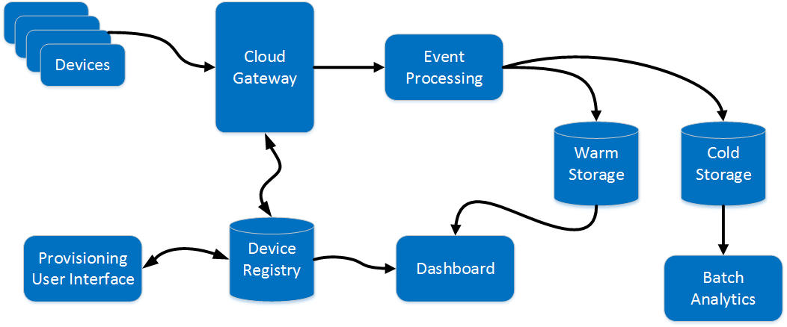

# Introducing the Journey

We want to tell a story about a fictitious company trying to build an IoT solution.

> To find out what we mean by "IoT solution", see [_What is an IoT solution?_][intro-to-iot].

In order to tell the story, we'll first establish a scenario meant to reflect common business requirements.
The scenario for our fictitious company is the prologue to the story. 
The scenario is not designed to be _realistic_, but rather _representative_ of actual challenges.
This scenario will drive our [backlog][]. 
As we progress on this journey, we will expand the scenario by adding new [milestones][]. 
Each milestone will have a specific set of goals, deliverables, and target date.
We'll also create an entry in this journal for each milestone.

## Meet Fabrikam

Fabrikam is a startup with a dozen employees. 
They have a background with .NET and Microsoft Azure. 
They also have a growing interest in technologies such as NodeJS, Hadoop, and Java.
They are planning to become a "smart-building service provider"; a company that provides "environmental monitoring services" on a contractual basis. 
Initially, they intend to offer their services to owners of high-end apartment buildings.
Once contracted, they would install devices in the apartment belonging.
These devices would report on temperature, humidity, smoke alarm and other environmental conditions.

Fabrikam will use the collected data to provide various services to the building owners.
They imagine services such as:
- Cost-saving on utilities
- Fire alerts
- Flood alerts (broken pipes, slow leaks, etc.)
- Unexpected temperature changes (indicating a broken HVAC)
- and more

In addition, Fabrikam thinks that giving individual tenants the ability to view
the current state of their own apartment through a mobile app can provide value.

Fabrikam landed their first contact before they even wrote a line of code.
Now they now have a few months to roll out a system to production.

## The People

> TODO: Introduce the key characters/personas in the story and establish their perspectives. 

## The Initial Release

The engineering team has reviewed what was promised to the customer and they have established 
the following high-level goals for their initial production deployment.

- Based on the number of apartment buidlings and number of devices needed per building, 
the system needs to support **100,000 provisioned devices**.
- Each device will be sending approximately **1 event per minute**. This means the system will need to ingest 
**~ 1,667 events per second**.
- Authorized users need to be able to provision and deprovision individual devices.
- The customer requires that all telemetry (the events sent from the devices) needs to be stored indefinitely.
- The customer wants to be able submit Hive queries from time to time, so the stored telemetry needs to be "Hive friendly".
- Autherized users need to be able to see an aggegragated recent state for a given building. 
For example, what is the average temperature in Buidling 25 currently? 
- The customer also has a number of devices collecting data that they would like to feed into Fabrikams system. 
However, these devices don't speak a standard protocol.
- While not necessarily a customer requirement, Fabrikam wants to avoid any downtime after the initial deployment. 
This includes downtime for system upgrades. They are interested in continuous deployment. 

The team came up with this proposed logical architecture.

- _Devices_ represent both the devices provided by Fabrikam as well as those legacy devices the customer has. 
(We're going to simulate the events from the devices in our implementation.)
- _Cloud Gateway_ is a cloud-hsoted service responsible for authenticating all devices. 
It is also where the system will translate for those devices that don't speak the standard language.
- _Event Processing_ is the part of the system that ingests and processes the stream of events. 
It is a composition point in the architecture allowing new downstream components to be added later.
- _Warm Storage_ will only store the recent aggregated state for each building. 
It will receive this state from Event Processing. It is "warm" because the data should be recent and easily accessible.
- _Cold Storage_ is where all of the telemetry is stored indefinitely.
- _Device Registry_ knows which devices are provisioned. Its data is used by the Cloud Gatewat as well as in the Dashboard.
- _Provioning UI_ is a user interface for provisioing and deprovisioning devices.
- _Dashboard_ is a user interface for exploring the recent aggregate state.
- _Batch Analytics_ is anticipating the Hive queries that the customer will want to run from time to time.

[intro-to-iot]: ../articles/what-is-an-IoT-solution.md
[backlog]: https://github.com/mspnp/iot-journey/issues
[milestones]: https://github.com/mspnp/iot-journey/milestones
