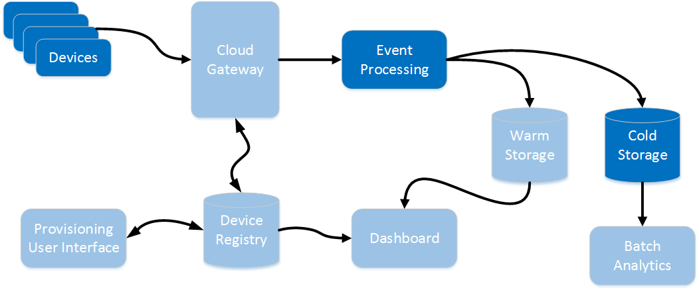
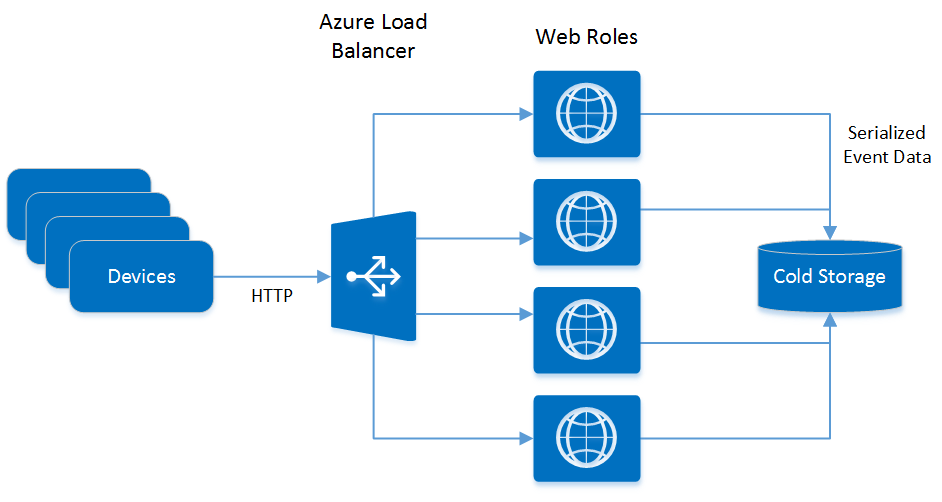
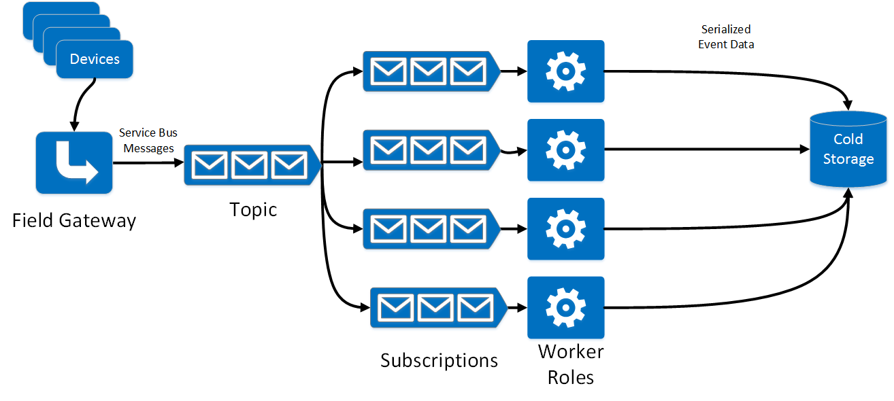
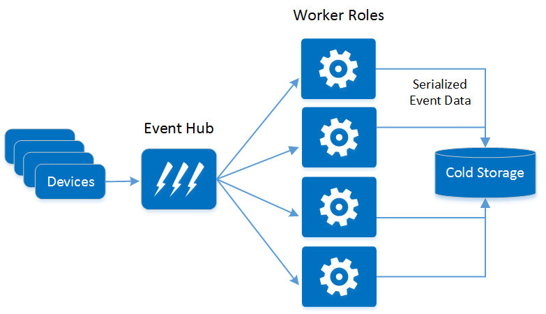
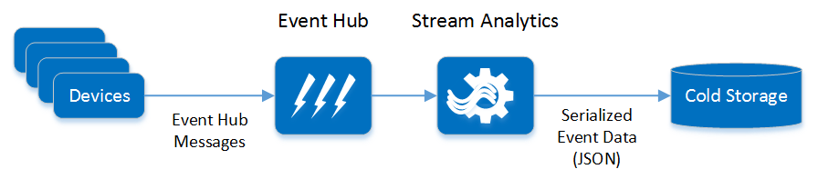

# Journal 1: Event Ingestion and Long-Term Storage

This journal entry covers the most basic end-to-end scenario in IoT: Getting events into the system and putting them into long-term storage. In terms of the logical architecture, it maps to the highlighted components shown here:c

- [Common requirements](#common-requirements)
- [Fabrikam requirements](#fabrikam-requirements)
- [Exploring solutions for ingestion and processing](#exploring-solutions-for-ingestion-and processing)
- [Exploring solutions for cold storage](#exploring-solutions-for-cold-storage)
- [Reference implementation](#reference-implementation)
- [Lessons learned](#lessons-learned)

## Common requirements

Here are some common requirements for ingestion and long-term storage that any IoT solution will at least need to consider:

- Authentication. Only authenticated devices can send data. (Provisioning devices is a separate scenario, although closely related.)
- Achieving scale. That means both hitting the expected target data rate, but also designing the system to be scalable in the future.
- Protecting the data stream.
- Storing the raw event data in long-term storage. It must hold a large volume of historical data indefinitely, at a reasonable cost. 

> Long-term storage is sometimes called *cold storage*, although traditionally "cold storage" meant tape backups. 

  
## Fabrikam requirements

:memo: For more about our Fabrikam scenario, see [Introducing the Journey][00-intro]. 

Here are some specific requirements for our scenario:

- As an initial target, the system must handle up to 100,000 devices, each device sending 1 reading every minute. That's approximately 1,667 events per second. This is a minimum load &mdash; the system should be scalable beyond this target. 
- The event data stream must be protected. This means not only securing the content of the events, but also masking the *absence* of events. For example, if the motion detectors in a house are not streaming any events, an attacker can conclude that nobody is home.
- The system will have several data pathways, not just the long-term storage path. Writing events to long-term storage should not introduce delays in the rest of the system. 
-  Related to the previous point, ideally failures in the long-term storage component won't affect the rest of the system.

## Exploring solutions for ingestion and processing

**Ingestion** and **event processing** are somewhat related. How the system ingests the events may limit the options for processing. We investigated the following options.   

- HTTP service
- Azure Service Bus topics + message subscriber
- Azure Event Hubs + custom event processor 
- Event Hubs + Azure Stream Analytics
- Event Hubs + Apache Storm 

> We chose Event Hubs and recommend this approach. The HTTP service approach has some significant drawbacks, described below. Service Bus topics are conceptually similar to Event Hubs, but Event Hubs is capable of much higher throughput, so it's a better fit for IoT scenarios.

### HTTP service

In this approach, devices (or the field gateway) send HTTP requests. The cloud service runs a simple HTTP service that receives the requests and writes them to storage. The HTTP service could be implemented as a web role in an Azure cloud service.

Notice that in this design, the HTTP service handles both ingestion and processing.

**Pros:**

- Technically straightforward and quick to prototype.

**Concerns:**

- **Throughput.** The system must avoid request timeouts. IIS puts requests in a queue until a worker thread picks them up. The thread pool must be large enough so that requests don't back up in the queue, possibly timing out. You can scale by adding more instances, and the Azure load-balancer will transparently direct requests to ensure an even distribution. However, there is a limit of 25 role instances per deployment. That should be enough for the Fabrikam scenario, but may not be enough for other scenarios.

> We briefly considered whether we could use virtual machines running an open source web server, optimized specifically for this task. However, that means taking responsibility for maintaining and patching the VMs and the web server software. There are also security concerns with this approach &mdash; it's not easy to harden a custom web server.

- **Load leveling.** A related problem is that the HTTP service handles both ingestion and processing. If the downstream processing can't keep up, it might cause ingestion to fail. A big advantage of the other solutions we explored is the use of a publisher/consumer model, separating ingestion from processing. (See [Queue-Centric Work Pattern][queue-centric-work-pattern] and [Queue-Based Load Leveling Pattern][queue-based-load-leveling].)

- **Connectivity**. Many simple devices can't send HTTP messages, and devices that *can* send HTTP messages are unlikely to use the same schema. Therefore, a field gateway may be needed to translate device messages.

> Many devices are designed to be simple; they output signals indicating events, and can receive signals for commands to be performed. They might not be capable of translating this data into different formats for integration into an IoT solution; this process typically requires some auxiliary hardware and/or software.

- **Resilience and reliability.** If an instance of the service fails, then any messages it is processing might be lost.

- **Authentication.** This approach requires building in some type of authentication, presumably using access tokens.  

- **Safety and security.** *THOUGHTS - How easy/difficult is it to protect the event data? How prone is a service to attack? What are the attack surfaces? TBD*

> It's not just the event data that requires protection, but also the endpoints that send and receive the data. If you can infiltrate an endpoint, perhaps by sending a spoof command to a device or rogue messages to a service, you may be able to gain control of the network.

- *Other concerns - runtime costs, ease of deployment, ...*

### Service Bus topics

In this approach, devices (or a field gateway) send event data to a Service Bus topic. Worker role instances subscribe to this topic to retrieve and process the events. 

**Pros:**

- **Scalability.** You can scale up the number of worker roles the process the events, independently of scaling the Service Bus instances.

- **Security.** Service Bus supports authentication using Shared Access Signature (SAS) tokens. On the processing side, the worker role gets messages from a well-known endpoint and does not accept unsolicited incoming traffic.

- **Performance** Service Bus supports the [AMQP] message protocol. This protocol is very efficient, using binary encoding, network flow control, long-lived connections, etc. 

**Concerns:**

- **Scalability.** There is a limit of 25 role instances per cloud service deployment.

- **Connectivity.** Devices need to be able to communicate with Service Bus in order to post messages. As before, local field gateways may be necessary to provide this connectivity.

### Event Hub + worker role

[Azure Event Hub][event-hubs] is a cloud-scale telemetry ingestion service. It is designed to capture millions of events per second in near real-time.

In this approach, devices (or a field gateway) send events to Event Hub. Worker role instances process the events.

**Pros:**

- **Reliability.** As described in the previous approach, the protocol provides reliability guarantees, helping to ensure that event data is not lost prior to ingestion. Data received by Event Hub is retained for a specified period (which can be measured in days). If a worker role fails when processing the data for an event, it can be restarted and data is not lost. 

- **Scalability.** Event Hub is highly scalable through partitioning. An event hub can contain up to 32 partitions; each partition can receive messages in parallel with other partitions. Event Hub is designed to handle a continuous, large influx of events. It can process up to 1MB/second of data per partition &mdash; well beyond requirements of our Fabrikam scenario.

- **Authentication**. Service Bus supports authentication using Shared Access Signature (SAS) tokens. You can set security policies to help protect Event Hub and authenticate message senders. Event Hub also supports blacklisting of devices; if a device is compromised or stolen, data transmitted by the device can be blocked on receipt by Event Hub.

**Concerns:**

- **Complexity.** Receiving data from Event Hub is a significantly different process from retrieving a message from a Service Bus queue. The [Event Hubs Programming Guide][event-hubs-programming-guide] contains the details.

- **Throughput.** Event Hub is priced in terms of throughput units. A throughput unit specifies the rate at which data can be sent and received by using Event Hub. If an application exceeds the number of purchased throughput units, performance will be throttled and may trigger exceptions. The DevOps team must constantly monitor the event hub to ensure that sufficient throughput units are available.

- **Scalability.** Although Event Hub is highly scalable, the same concerns with the scalability of worker roles outlined in the previous approach are still present: will they be able to keep up with the outflow of data from Event Hub?

### Event Hub + Azure Stream Analytics

[Azure Stream Analytics][stream-analytics] is a real-time stream processing service. It can capture incoming streams of data from many sources, combine them, and arrange for these streams to be processed and send the results to one or more destinations.

In this approach, devices (or a field gateway) send events to Event Hub. Stream Analytics takes the events as input and writes them directly to storage. (Stream Analytics can write to Azure Blob storage, Azure Table storage, or Azure SQL database.)  

**Pros:**

- **Ease of Use:** Stream Analytics uses a declarative model to specify the input and output streams, and the transformations to be performed by the processing. It can gather data directly from Event Hub as well as sources such as Blob storage, and can emit data to Event Hub, Blob storage, Table storage, and Azure SQL Database.

- **Scalability:** As with Event Hub, Stream Analytics is designed to be highly scalable, capable of supporting event handling throughput of up to 50Mb/second. Stream Analytics will automatically scale based on the event ingestion rate, complexity of processing, and expected latencies.

- **Reliability:**  The Stream Analytics service is built to persist state and cache output efficiently. These features provide fast recovery from processing node failures, quickly reprocessing lost state.

**Concerns:**

- **Event Metadata.** The event stream passed to Stream Analytics does not include the event metadata that is captured by Event Hub. This metadata can be valuable and can include information not available in the main payload of the event data. If this metadata is required, it might be necessary to connect directly to Event Hub and use an alternative approach to Stream Analytics.

### Event Hub + Apache Storm

:construction: TBD 

## Exploring solutions for cold storage

For cold storage, we looked at the following options:

- Azure SQL database
- Azure Table storage
- Azure Blob storage

This list was motivated partly because Azure Stream Analytics can write to all of them (see previous section).

### Azure SQL Database

[Azure SQL Database][sql] is an excellent choice for storing structured relational data. However, you need to carefully consider performance and size requirements. 

Azure SQL Database is priced by service tier. Each tier provides different performance and storage capabilities, ranging from 5 transactions per second and a 2GB database, up to 735 transactions per second and 500GB of storage at the top end. 

Even at the highest tier, the throughput might not be enough to record our target of ~1667 events per second, assuming that Stream Analytics sends each event as a single operation. And even though 500GB sounds large, it can fill up. If each event record requires 20 bytes of storage, a 500GB database can hold approximately 175 days' worth of events.  

Because databases are held on a shared database server, the infrastructure has to ensure that resources are balanced carefully. You purchase database resources in terms of Database Throughput Units (DTUs), which are based on a blended measure of CPU, memory, reads, and writes. If an application exceeds its quota of DTUs it will be throttled.

> Azure SQL Database is not ideally suited to chatty applications or systems that perform a large number of data access operations that are sensitive to network latency. 

The operational costs of using Azure SQL database for this solution could be excessive, given the throughput and storage requirements. Moreover, the Fabrikam scenario simply doesn't need all of the rich features of a relational database. The event data is not relational; we just want to save it quickly and efficiently.

### Azure Table storage

[Table storage][table-storage] is a key/value store that can save large volumes of structured data. A table stores multiple rows, each up to 1MB in size, and you can store up to 500TB of data in a table &mdash; approximately 950 years of event data if each record is 20 bytes. The documented [scalability targets][storage-scalability-targets] for Azure Storage specify that the system should be able to handle up to 20000 messages per second  for messages that are 1KB in size, and a total inbound bandwidth of between 10 and 20GB per second.

You should consider using Azure Table storage when:

- Your application must store significantly large data volumes (multiple terabytes) while keeping costs down.

- Your application stores and retrieves large data sets and does not have complex relationships that require server-side joins, secondary indexes, or complex server-side logic.

- Your application requires a flexible data schema to store non-uniform objects, the structure of which may not be known at design time.

- Your business requires disaster recovery capabilities across geographical locations in order to meet certain compliance needs. Azure tables are geo-replicated between two data centers hundreds of miles apart on the same continent. This replication provides additional data durability in the case of a major disaster.

- You need to store more data than you can hold by using Azure SQL Database without the need for implementing sharding or partioning logic.

- You need to achieve a high level of scaling without having to manually shard your dataset.

> Table storage should be cost effective, because it is relatively cheap compared to some other options. It is also fast. But if we simply want to blast the data into a data store for later processing, do we really need to save it as structured data? The data is being provided from Stream Analytics as a JSON string, so its quicker to save that information in its native format rather than parse it into a set of fields and allocate a unique key for each record.

### Azure Blob storage

[Blob storage][blob-storage] enables you to store large amounts of unstructured information, such as text or binary data, quickly and efficiently. It doesn't provide the search and filtering capabilities of Table storage, but is ideal for saving a high-volume stream of data. Each stream can be handled and named like a file, and a new stream could be created each for working day (or for each hour, possibly). The scalability targets are the same as for Table storage; Fabrikam should be able to store up to 950 years worth of data at a rate of up to 20000 records per second.

## Reference implementation

For the reference implementation, we picked the following design:

- **Event Hub** and **Stream Analytics** for event ingestion and processing. Although these technologies are very new, the scalability, reliability, securability (the ability to verify and protect event information as it is received), and ease of use swung the decision; the maintenance and monitoring costs of this solution are far less than those concerned with using web and worker roles.
- **Blob storage** for cold storage technology. Stream Analytics outputs the event data as a JSON formatted string which is streamed to a file held in Blob storage. This choice meets our requirements for throughput and capacity, and has relatively low costs. Data durability in the event of a disaster can be guaranteed by configuring blobs to use geo-replication across data centers.

:construction: **TODO: Would be good to show table of costs, comparing web/work roles to EH, Stream Analytics** 

The device simulator sends events directly to Event Hub. A Stream Analytics job fetches the data for every event and sends it to cold storage. The data for each event is saved to Blob storage as a line-delimited JSON object for maximum interoperability.

In addition, we decided to implement a secondary batch processor for handling events directly from Event Hub. This batch processor has access to the event metadata that is not available to Stream Analytics and can perform additional processing based on this information. The results are also saved in cold storage.

> While it might be useful to store the event data in a format that makes it easy to analyze, BI tools can retrieve the data from Blob storage and examine it offline. 

## Lessons learned

We ended up spending a significant amount of time on the device simulator. It is important to simulate a realistic number of devices, sending events at the expected rate. In our original planning, we didn't give much thought to the simulator, but in talking to customers, this turns out to be a very common requirement. 

We hit the following issues when using Stream Analytics to save data to Blob storage:

- HDInsight Hive queries will fail when running against data held in blob files being actively written to by Stream Analytics. It is possible to workaround this problem by ignoring blob access exceptions.
- HDInsights requires the data held in Blob storage to be JSON formatted with each record on a new line. This requires configuring the Stream Analytics output format appropriately.

*TODO Others?*

[00-intro]: .\00-introducing-the-journey.md
[traffic-manager]: https://azure.microsoft.com/documentation/articles/traffic-manager-overview/
[AMQP]: https://www.amqp.org/
[event-hubs-programming-guide]: https://msdn.microsoft.com/library/azure/dn789972.aspx
[sql]: http://azure.microsoft.com/en-us/services/sql-database/
[table-storage]: https://azure.microsoft.com/documentation/articles/storage-dotnet-how-to-use-tables/
[storage-scalability-targets]: https://azure.microsoft.com/documentation/articles/storage-scalability-targets/
[blob-storage]: http://azure.microsoft.com/documentation/articles/storage-dotnet-how-to-use-blobs/
[event-hubs]: http://azure.microsoft.com/services/event-hubs/
[stream-analytics]: http://azure.microsoft.com/services/stream-analytics/
[milestone]: https://github.com/mspnp/iot-journey/milestones/Milestone%2001
[queue-based-load-leveling]: https://msdn.microsoft.com/en-us/library/dn589783.aspx
[queue-centric-work-pattern]: http://www.asp.net/aspnet/overview/developing-apps-with-windows-azure/building-real-world-cloud-apps-with-windows-azure/queue-centric-work-pattern
