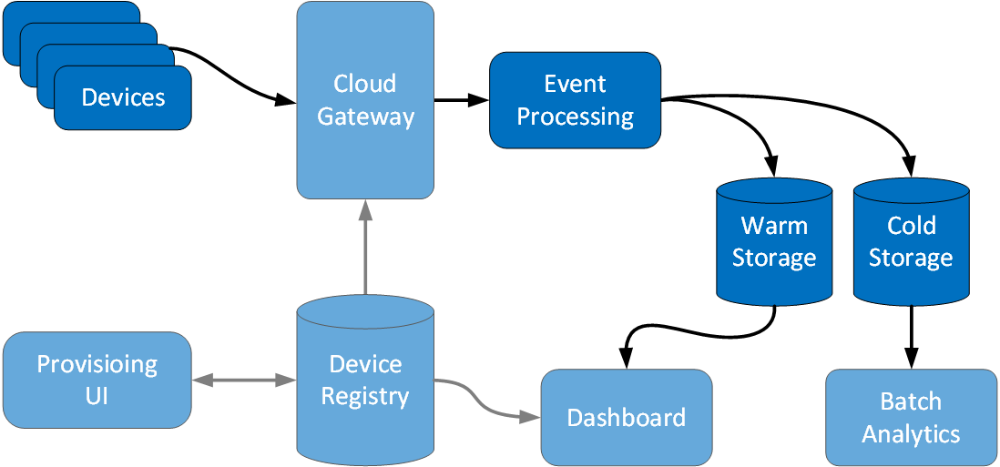

#Journal Entry #1
_First Steps_

:pencil2: working draft

## Fabrikam's perspective
Fabrikam's engineering team has very little experience with high-scale event-oriented systems. 
They want to make sure that they are [asking the right questions][orientation].
They also need to get a minimum viable product deployed.

For their [first milestone][milestone] they want to:
- Ingest a representative set of simulated events.
- Store all the events for later analytics. [*][cold-storage]
- Store the most recent average temperature _per building_ to within 5 minutes. [*][warm-storage]
- Increase the scale until they match the targets for there first contract [*][increase-scale]

They need a basic implementation that maps to these components of the logical architecture:

- Devices
- Event Processing
- Warm Storage
- Cold Storage

### Devices

The simulated events will be produced in .NET code. The simulator is a class libary. 
Initially, the simulator library will be hosted as a console app. However, it is possible to host 
it as a service as well.

### Event Processing

This component will be implemented using the following Azure services:
 - [Event Hubs][event-hubs], a cloud-scale telemtry ingestion serivce.
 - [Stream Analytics][stream-analytics], a real-time stream processing service.
 
We'll send the simulated events directly to an event hub. Then we'll create a processsing job 
in Stream Analytics that:
 - Stores every event in cold storage as a line-delimited JSON object.
 - Calculates the average temperature per building over a 5 minute window and stores it in warm storage.
 
### Warm Storage

For warm storage, we'll use [Azure SQL Database][sql]; a relational database as a service. 
We'll validate the data in warm storage by manually querying the database.

### Cold Storage

For cold storage, we'll use [Blob storage][blob-storage]; a service for storing large amounts of unstructured data.
 
## Why did we make these choices?

1. Why did we decide to use [Event Hubs][event-hubs]?
1. Why did we decide to use [Stream Analytics][stream-analytics]?
1. Why did we decide to use [Blob storage][blob-storage]?
1. Why did we decide to use [Azure SQL Database][sql]?

> TODO What are other choices we need to include?

## What we discovered
> TODO List the insights, points of confusion, and challenges that we encountered during this step of the journey

[sql]: http://azure.microsoft.com/en-us/services/sql-database/
[blob-storage]: http://azure.microsoft.com/en-us/documentation/articles/storage-dotnet-how-to-use-blobs/
[event-hubs]: http://azure.microsoft.com/en-us/services/event-hubs/
[stream-analytics]: http://azure.microsoft.com/en-us/services/stream-analytics/
[milestone]: https://github.com/mspnp/iot-journey/milestones/Milestone%2001
[orientation]: https://github.com/mspnp/iot-journey/issues/20
[cold-storage]: https://github.com/mspnp/iot-journey/issues/26
[warm-storage]: https://github.com/mspnp/iot-journey/issues/47
[increase-scale]: https://github.com/mspnp/iot-journey/issues/30