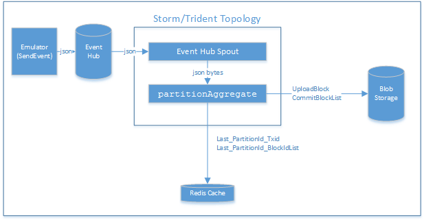

# Architecture Overview

# Introduction

The scenario used to illustrate an end to end data pipeline is  a vehicle telematics scenario, simulating a large number (target 100k) of vehicles publishing a variety of messages (events) directly onto [Event Hub][eventhubpage].

From there the event streams are read by OpaqueTridentEventHubSpout in batches and stored in to Azure blobs for big data style analytics.  



As seen in the diagram above, the Emulator is an **event producer**, while the Event Hub Spout is an  **event consumer**.  As this guidance evolves, additional producers and consumers will be added to the reference implementation (and documentation about engineering choices and tradeoffs).

The scale target of this guidance was to produce (and consume) event streams from 100,000 simulated vehicles, each generating on average one event every 10 seconds (6 events per minute).  

[eventhubpage]: EventHubService.md]

## Emulator (SendEvent Console App)

The Emulator is a c# Console App **SendEvent** that acts as an event producer to enable you to generate a stream of events that are sent to your Event Hub from a set of simulated devices (cars).

The Configuration for SendEvent Console App is set in the file Program.cs

``` C#
static int numberOfDevices = 1000;
static string eventHubName = "[YourEventHubName]";
static string eventHubNamespace = "[YourServiceBusNamespaces]";
static string sharedAccessPolicyName = "devices";
static string sharedAccessPolicyKey = "[YoursharedAccessPolicyKey]";
static string eventHubConnectionStr = "Endpoint=sb://[eventHubNamespace].servicebus.windows.net/;SharedAccessKeyName=RootManageSharedAccessKey;SharedAccessKey=[YourSharedAccessKey]";

```

## Event Hub

Microsoft Azure Service Bus Event Hub is an event ingestor service that provides event and telemetry ingress to the cloud at massive scale, with low latency and high reliability. In this solution, the **SendEvent**  Console app is the event producer that generate events and deliver them to the Event Hub service. This solution include downstream storm/trident topology  that act as event consumer.

When you configure the Event Hub service, you specify a namespace and the number of partitions to use. For more information about how this solution uses Event Hub, see the page [Event Hub][eventhubpage].

## Storm/Trident Topology

Storm/Trident Topology is an event consumer that receive events from the Event Hub service in batches. The topology is implemented in Java. The topology consisits of two parts: an Event Hub Spout called OpaqueTridentEventHubSpout and and a Trident partitionAggregate called  ByteAggregator.

## OpaqueTridentEventHubSpout
**OpaqueTridentEventHubSpout** is one of the many storm/trident spouts in *eventhubs-storm-spout-0.9-jar-with-dependencies.jar* which is shipped with HDInsight Storm. As the name suggested, the spout is an Opaque Trident Spout which reads the messages from event hub, and can replay the messages if the downstream processors fail so that the message will be processed at least once.

The Configuration for Event Hub Spout is set in the file Config.properties

```
eventhubspout.username = storm
# shared access key for the above event hub policy
eventhubspout.password = [shared access key for the above event hub read policy]
eventhubspout.namespace = [YourServicebusNamespace]
eventhubspout.entitypath = [YourEventhubName]
eventhubspout.partitions.count = 10
# if not provided, will use storm's zookeeper settings
# zookeeper.connectionstring=localhost:2181
eventhubspout.checkpoint.interval = 10
eventhub.receiver.credits = 1024
```


## ByteAggregator
**ByteAggregator** is developed in this guidance to facilitating cold storage of data for later analytics. It translates the chatty stream of events into chunky blobs. BaseAggregator is a java class that extends  storm.trident.operation.BaseAggregator class. It combines individual messages in a batch in to Azure blocks in its **aggregate** method and persist blocks in its **complete** method. TheByteAggregator tries to maximize the amount of data that it can store in a single blob by filling each block in the block blob as close to its maximum configured capacity or  as is feasible.

## Implementation for Exactly-once Cold Storage
**OpaqueTridentEventHubSpout** guarantees at-least-once process of messages by replay if errors occur. However, when replay, some messages may have already been stored in the Azure block. We need to remove those blocks so that each message is stored in Azure block exactly once.

For each batch of messages emitted by the spout, ByteAggregate persists messages in a list of blobName-BlockId. This guidance reference implementation stores that list in Microsoft Azure Redis Cache using the key **p_xxxxx_blocklist** (where xxxxx is the partition id).  The other information stored in Azure Redis Cache is the transaction id  use the key **p_xxxxx_txid**. Whenever ByteAggregate starts process a new batch on a partition, it compare its transaction id with the one stored in Redis to find out whether the batch is a replay or not. In case for a replay, the Azure blocks listed on the Redis cache will be deleted before the process begin.

The Configuration for Redis Cache is set in the file Config.properties


```
#Redis cache
redis.host = [YourRedisName].redis.cache.windows.net
redis.password = [YourRedisKey]
```

## Upload blob to Microsoft Azure Storage

Uploading blob to Azure is implemented using [Microsoft Azure SDK for Java](https://github.com/Azure/azure-sdk-for-java)
and
[Microsoft Azure Storage libraries for Java](https://github.com/Azure/azure-storage-java). The setting for
Azure blob storage is set in the file Config.properties

```
storage.blob.account.name = [YourStorageAccountName]
storage.blob.account.key =[YourStorageAccountKey]
storage.blob.account.container = [YourStorageAccountContainerName]
#number of blocks in each blob default to 50000
storage.blob.block.number.max = 2
#max bytes in each block default to 4194304 Byte
storage.blob.block.bytes.max = 1024

```

## Instrumentation
HDInsight Storm cluster provides perfcounters for spout and bolt which can be used instrument the OpaqueTridentEventHubSpout and ByteAggregator.

## Logging

The storm/trident application uses self4j for logging. The log setting can be configured by change the constants in **LogSetting** class.

The following is the LogSetting class

``` java
public class LogSetting {
  public static final boolean LOG_MESSAGE = false;

  public static final boolean LOG_BATCH = true;
  public static final boolean LOG_INSTANCE = true;

  public static final boolean LOG_BLOCK_ROLL_OVER = false;

  public static final boolean LOG_BLOCK = false;
  public static final boolean LOG_PERSIST = true;
  public static final boolean LOG_GET_LAST_BLOCK = true;
  public static final boolean LOG_GET_FIRST_BLOCK = true;

  public static final boolean LOG_BLOB_WRITER = false;
  public static final boolean LOG_BLOB_WRITER_DATA = false;
  public static final boolean LOG_BLOB_WRITER_BLOCKLIST_BEFORE_UPLOAD = false;
  public static final boolean LOG_BLOB_WRITER_BLOCKLIST_AFTER_UPLOAD = false;

  public static final boolean LOG_REDIS = true;

  public static final boolean LOG_METHOD_BEGIN = false;
  public static final boolean LOG_METHOD_END = false;
}
```


## Configuration

The storm/trident topology use the standard **config.properties** file for application configuration. The Emulator (SendEvent C# Console App) has the configuration setting in the Program.cs file for simplicity.


## HDInsight Storm cluster

An HDInsight Storm cluster enables you to deploy the topology created in this reference implementation, run the topology, and monitor the performance of your running topology. Also, you need to create a HDInsight Storm cluster in order to download the **eventhubs-storm-spout-0.9-jar-with-dependencies.jar** which consists the required **OpaqueTridentEventHubSpout**.

However, you may run and debug the topology in your local development without the storm cluster.

[eventhubpage]: EventHubService.md
